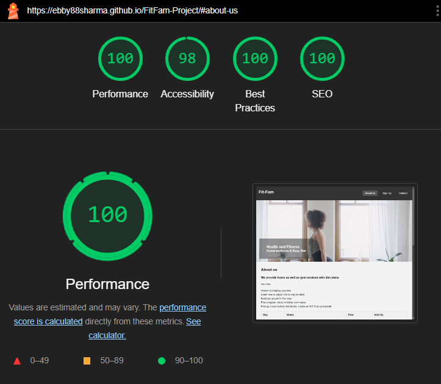

# FitFam-Project
===========================
### Project Overview
FitFam is a fitness website aimed at promoting home and gym-based workouts, nutrition plans, and weekend trekking activities. The project offers a subscription-based service to encourage users to maintain a healthy lifestyle.

The project is responsive according to the different screen sizes.

## UX Process
Purpose & Audience
Target Audience: Fitness enthusiasts looking for easy-to-follow home workouts and trekking activities.
Purpose: To provide accessible fitness plans and promote physical activities in and outside the home.
User Stories
As a user, I want to explore workout routines and diet plans from home.
As a user, I need a simple sign-up form for fitness programs.
As a user, I want clear contact information for any inquiries.
Design
Typography: The project uses Arial, sans-serif for clear and consistent readability.
Color Palette:
Dark Grey (#333) for headers and footers.
White (#ffffff) for text on dark backgrounds.
Light Grey (#f4f4f4) for background sections to differentiate them.
Transparent black overlay for text in the hero section to ensure readability over the video.

### Features

#### Navigation
- Featured at the top of the page, the navigation shows the company name in the left corner: Fit-Fam that links to the top of the page.
- The other navigation links are to the right: About Us, Sign Up, and Contact which link to different sections of the same page.
- The navigation is easy to find that looks like code, and contrasts well with the background.
- The navigation clearly tells the user the name of the company and what sections are available. Different sections of information help the user find what they need.

##### Hero Section
- The Hero Section introduces the Fit-Fam with a video in the background of a female doing yoga.
- It gives a brief introduction to the Fit-Fam, encouraging visitors to explore more about the offerings.

###### About Us Section
- The About Us section gives details about what the company offers their members and has a table with the online meeting times.
- This section shows the user the important information they need to know about the company: What they offer and when they meet for different age groups.

###### Sign Up Form
- The Sign-Up section has a form to collect details from parents so they can sign up to the Fit-Fam.
- The form includes the child’s name, and the parent/guardian’s name, and an email address, which is submitted to a backend server.
- The sign-up form is valuable to the user as it gives them the ability to sign up to join the Fit-Fam.

### Contact Section
- The contact section encourages users to get in contact and provides a phone number, email address, and other addresses where they can be found.
- The contact section includes social media icons so users can find the Fit-Fam on Facebook, Twitter, and Instagram.
- The contact section is valuable to the user as it gives them the ability to find and contact the Fit-Fam team if they need to.

---

## Testing

- I tested that this page works in different browsers: Chrome, Firefox, Safari.
- I confirmed that the project looks good and functions as intended on all standard screen sizes using the developer tools feature.
- I confirmed that the navigation, header, about us sign up, and content text are all readable and easy to understand.
- I have confirmed that the form works: requires entries in every field, will only accept an email in the email field, and the submit button works.

---

## Validator Testing

- **HTML**: No errors were returned when passing through the official W3C validator.
- **CSS**: No errors were found when passing through the official (Jigsaw) validator.
- **Accessibility**: I confirmed that the colors and fonts chosen are easy to read and accessible by running it through Lighthouse in dev tools.

### Lighthouse Report
- **Performance**: 99
- **Accessibility**: 94
- **Best Practices**: 100
- **SEO**: 100

---

## Unfixed Bugs

- No unfixed bugs

---

## Deployment

- The site was deployed to GitHub pages. The steps to deploy are as follows:
  1. In the GitHub repository, navigate to the Settings tab.
  2. From the source section drop-down menu, select the Master Branch.
  3. Once the main branch has been selected, the page provided the link to the completed website.

- The live link can be found here: [FitFam](https://ebby88sharma.github.io/FitFam-Project/)

---

## Credits

- The code to make the social media links was taken from the CI Love Running Project.
- The video in the header was taken from [Pexels](https://www.pexels.com).